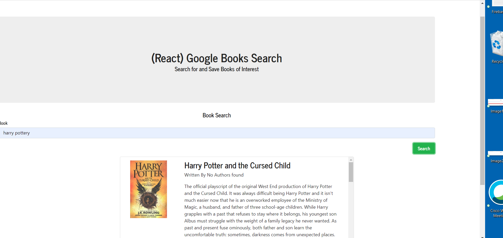
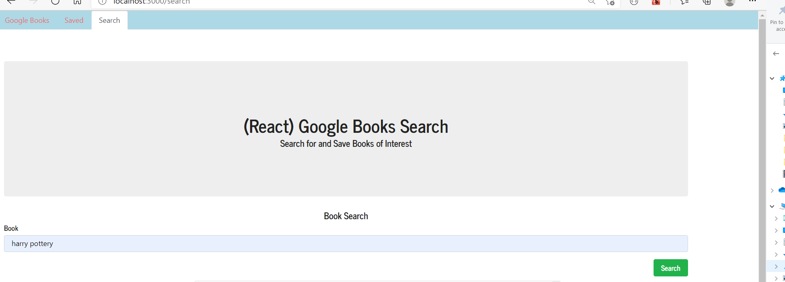
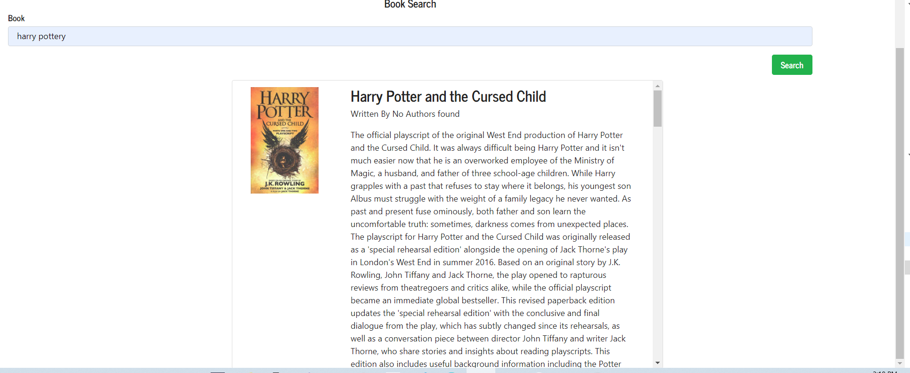
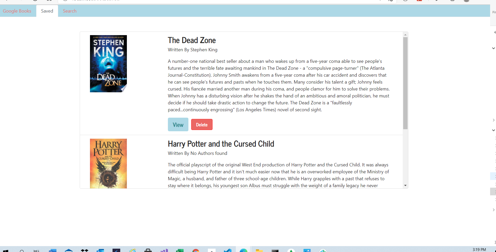
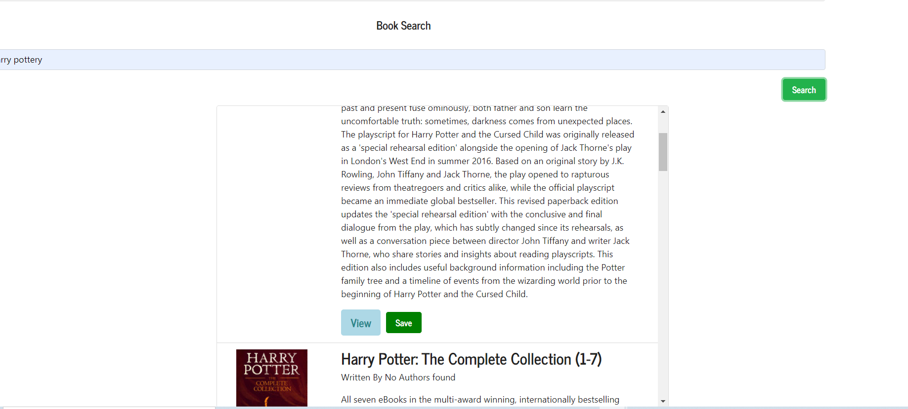

# google-book-react-search-02.13.21

## About The Project

---

-    User can search for books via the Google Books API and render them. User has the option to "View" a book, bringing them to the book on Google Books, or "Save" a book, saving it to the Mongo database.

-    User can renders all books saved to the Mongo database. User has an option to "View" the book, bringing them to the book on Google Books, or "Delete" a book, removing it from the Mongo database.

## Implemented the following functionalities

-    Search book from Google Book API
-    Save book to db

## Built With

-    React components
-    Node
-    Express
-    MongoDB
-    Google Book API

## Getting Started

To get a local copy up and running follow below steps.

## Prerequisites

None

## Installation instructions:

Clone the repo git clone git@github.com:NirmalaAbothu/google-book-react-search-02.13.21.git then open Git Bash window ,navigate to project folder "google-book-react-search-02.13.21" then run
following commands

-    Make a package.json file by running `npm init` from the command line.
-    `npm install axios`
-    `npm install react-bootstrap bootstrap`
-    `npm install --save react-router'
-    `npm start`
-    Navigate to the browser and type: `localhost:3000'

## Credits

### Followed the below documentation

-    ReactJS documentation

## License & copyright

Copyright © 2020 Nirmala Abothu

[Deployed Heoku Link](https://booksearc.herokuapp.com/)
